# 📘 Project_Dnd: Аналітична вебсистема для Dungeons & Dragons

> Клієнт-серверний вебзастосунок для управління тактичними бойовими зіткненнями у D&D з інтегрованим математичним рушієм прогнозування складності бою та механізмом серверного маскування даних.

---

## 👤 Автор

- **ПІБ**: Черепака Тарас Іванович
- **Група**: ФЕІ-41
- **Керівник**: Злобін Григорій Григорович, к.т.н., доцент
- **Університет**: Львівський національний університет імені Івана Франка
- **Дата виконання**: 30.05.2026

---

## 📌 Загальна інформація

- **Тип проєкту**: Аналітична вебсистема (Single Page Application + REST API)
- **Мови програмування**: C# 13, JavaScript/TypeScript
- **Фреймворки / Бібліотеки**: 
  - *Backend*: .NET 9 (ASP.NET Core Web API), Entity Framework Core
  - *Frontend*: React 19, React Router, Zustand, dnd-kit (для Drag-and-Drop)
  - *База даних*: PostgreSQL

---

## 🧠 Опис функціоналу

- **Безпека та авторизація**: JWT-авторизація, логін через Google та Discord (OAuth 2.0).
- **Управління ініціативою**: Динамічний бойовий трекер з механікою Drag-and-Drop для зміни черги ходів.
- **Математичне прогнозування (Combat Engine)**: Серверний розрахунок очікуваної шкоди (eDPR) та часу до знищення фракцій (Time to Kill) за квадратичним законом Ланчестера.
- **Захист від метагеймінгу (Field of View)**: Алгоритм серверної приховання даних, що приховує точні значення HP та характеристики ворогів від гравців (відображення статусів на кшталт "Bloodied", "Dead").
- **Оптимізований доступ до даних**: Вирішення проблеми Overfetching через строгі LINQ-проєкції (`.Select()`) замість важких `JOIN` під час клієнтського опитування (Short-Polling).
- **Інтеграція з месенджерами**: Асинхронна пакетна відправка логів та результатів кидків у Discord Webhooks (алгоритм Batching з використанням `StringBuilder`).

---

## 🧱 Опис основних класів / файлів

| Клас / Файл / Компонент | Призначення |
|-------------------------|-------------|
| `CombatAnalyticsEngine.cs` | Ядро аналітики: розраховує eDPR, TTK та інтерполює ймовірність виживання партії |
| `Character.cs`          | Багата доменна сутність (Rich Domain Model) персонажа з інкапсульованою логікою |
| `EncountersController.cs`| REST API ендпоінти управління боями ("Тонкий контролер") |
| `OAuthService.cs`       | Сервіс для обміну кодів авторизації на JWT через Google/Discord API |
| `EncounterTracker.jsx`  | Головний React-компонент бойового трекера (Frontend) |
| `AnalyticsDashboard.jsx`| Умовний рендеринг панелі аналітики (тільки для Майстра гри) |

---

## ▶️ Як запустити проєкт "з нуля"

### 1. Встановлення інструментів

- .NET 9.0 SDK
- Node.js (v18 або новіше) + npm
- PostgreSQL (локально на порту 5432 або в хмарі)

### 2. Клонування репозиторію

```bash
git clone https://github.com/TarasChep/Project_Dnd_Public.git
cd Project_Dnd_Puclic
```

### 3. Налаштування Backend

```bash
cd DnD.Api
# Оновлення залежностей
dotnet restore

# Налаштування секретів (або редагування appsettings.json)
dotnet user-secrets init
dotnet user-secrets set "ConnectionStrings:DefaultConnection" "Host=localhost;Database=dnd_db;Username=postgres;Password=your_password"
dotnet user-secrets set "OAuth:Google:ClientId" "YOUR_CLIENT_ID"

# Застосування міграцій до БД
dotnet ef database update --project ../DnD.Infrastructure

# Запуск сервера (за замовчуванням http://localhost:5142)
dotnet run
```

### 4. Налаштування Frontend

```bash
cd ../frontend
# Встановлення залежностей
npm install

# Запуск React-сервера (Vite)
npm run dev
```

---

## � Налаштування OAuth та Webhook

### Google OAuth 2.0

1. **Перейти до Google Cloud Console**: https://console.cloud.google.com/
2. **Створити новий проєкт** або вибрати існуючий
3. **Активувати Google+ API**:
   - Перейти в "APIs & Services" → "Library"
   - Пошукати та активувати "Google+ API"
4. **Створити OAuth 2.0 Credentials**:
   - Перейти в "APIs & Services" → "Credentials"
   - Натиснути "Create Credentials" → "OAuth client ID"
   - Вибрати тип "Web application"
   - Додати Authorized redirect URIs: `http://localhost:5000/api/auth/oauth/google/callback`
5. **Скопіювати** `Client ID` та `Client Secret` у `appsettings.Development.json`

📖 **Детальна інструкція**: https://developers.google.com/identity/protocols/oauth2

---

### Discord OAuth 2.0

1. **Перейти до Discord Developer Portal**: https://discord.com/developers/applications
2. **Натиснути "New Application"** та дати йому назву
3. **Перейти в "OAuth2" → "General"**:
   - Скопіювати `Client ID`
4. **Перейти в "OAuth2" → "URL Generator"**:
   - Вибрати scope: `identify`, `email` (для авторизації)
5. **Налаштувати Redirect URLs**:
   - Додати: `http://localhost:5000/api/auth/oauth/discord/callback`
   - Натиснути "Save"
6. **Скопіювати** `Client Secret` (натиснути на "Reset Secret" якщо його немає)
7. **Додати дані** у `appsettings.Development.json`

📖 **Детальна інструкція**: https://discord.com/developers/docs/topics/oauth2

---

### Discord Webhook

1. **Створити або обрати сервер** у Discord
2. **Перейти в "Server Settings" → "Integrations" → "Webhooks"**
3. **Натиснути "New Webhook"**:
   - Вибрати канал для отримання повідомлень
   - Дати назву (наприклад "DnD Bot")
   - Натиснути "Save"
4. **Скопіювати URL Webhook** (приватна адреса для відправки повідомлень)
5. **Додати URL** у конфігурацію вашої програми

📖 **Детальна інструкція**: https://support.discord.com/hc/en-us/articles/228383668-Intro-to-Webhooks

---

## �🔌 API приклади

### 🔐 Авторизація (Вхід)

**POST /api/auth/login**

**Request:**
```json
{
  "email": "player@example.com",
  "password": "MySecretPassword123"
}
```

**Response:**
```json
{
  "token": "eyJhbGciOiJIUzI1NiIsInR5cCI6IkpXVCJ9..."
}
```

### ️ Отримання списку персонажів

**GET /api/characters**

*(Потребує Bearer Token у заголовку Authorization)*

**Response:**
```json
[
  {
    "id": "3fa85f64-5717-4562-b3fc-2c963f66afa6",
    "name": "Thorin Oakenshield",
    "race": "Dwarf",
    "class": "Fighter",
    "level": 5,
    "currentHp": 45,
    "maxHp": 45
  }
]
}
```

---

## 🖱️ Покрокова інструкція користувача (Зі скріншотами)

### Крок 1: Авторизація (Log In)
Відкрийте застосунок та оберіть зручний спосіб входу. Ви можете використати стандартну реєстрацію за email/паролем або швидкий вхід через **Google** чи **Discord** (OAuth 2.0).

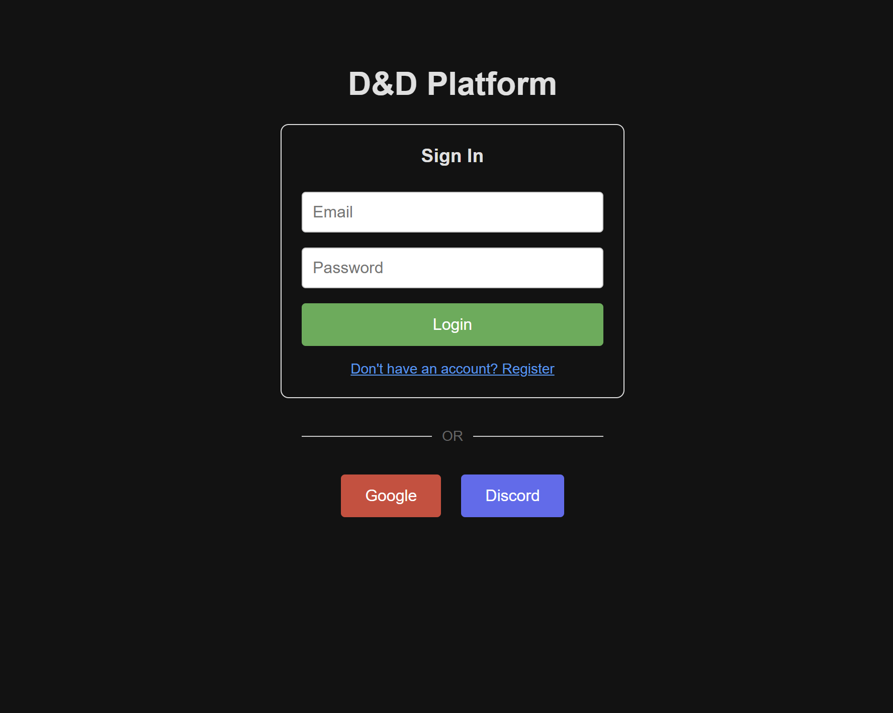

**Доступні способи входу:**
- Email + Password (стандартна реєстрація)
- Google OAuth 2.0
- Discord OAuth 2.0

### Крок 2: Створення персонажа та управління інтерактивним листом
Після авторизації перейдіть у розділ **Characters** та створіть нову анкету. Замість статичної таблиці відкриється повноцінний інтерактивний лист персонажа, який функціонує як SPA (Single Page Application).

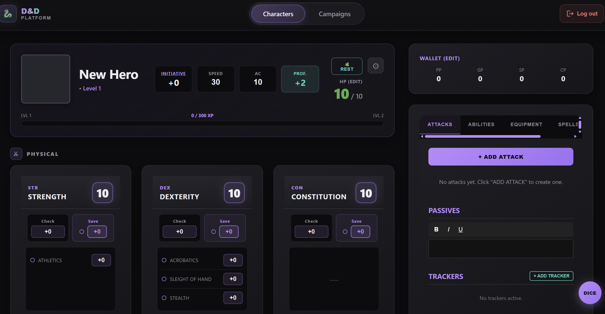

**Ключові можливості інтерфейсу:**
* **інтерактивність (Click-to-Edit):** Жодних статичних текстів. Усі показники (HP, Базові характеристики, Гаманець) редагуються "на льоту" простим кліком по відповідному блоку.
* **Динамічний перерахунок:** Зміна базових статів (STR, DEX, CON) автоматично впливає на пов'язані навички, рятівні кидки (Saves) та перевірки характеристик (Checks).
* **Модульне управління:** Система вкладок праворуч дозволяє миттєво перемикатися між Атаками, Здібностями, Інвентарем та Заклинаннями без перезавантаження сторінки.
* **Кастомні трекери та Дайсер:** Додавайте власні лічильники ресурсів (Trackers) для відстеження стріл чи магічних слотів, а також використовуйте плаваючу кнопку **DICE** для кидків, які інтегруються з вашими поточними модифікаторами. Усі зміни миттєво синхронізуються із сервером.

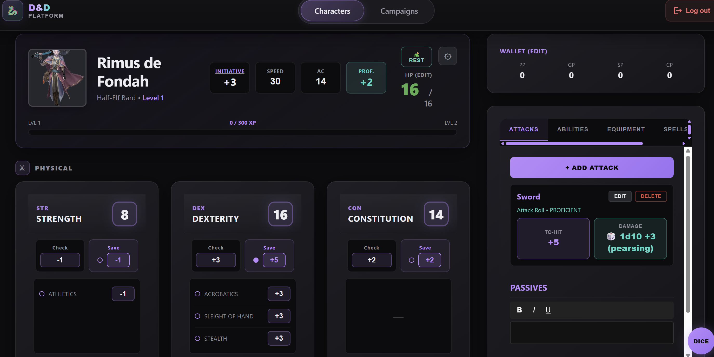

**Керування HP та трейкерами:**

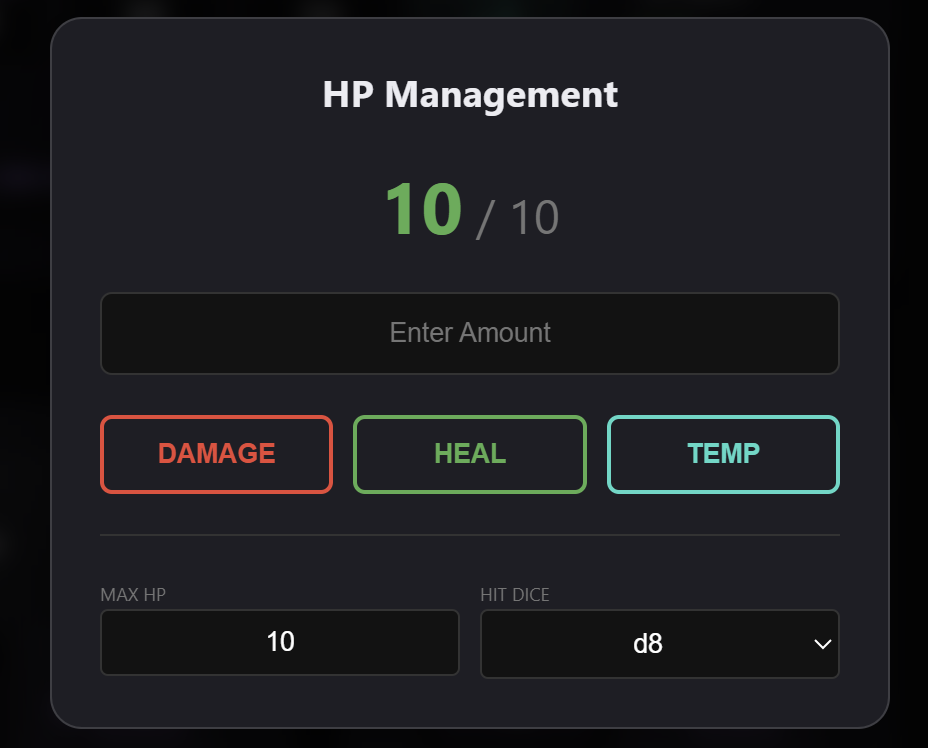

**Додавання атак:**

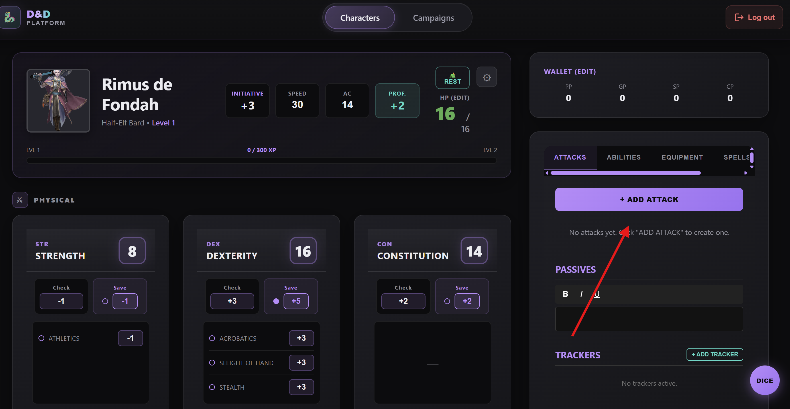

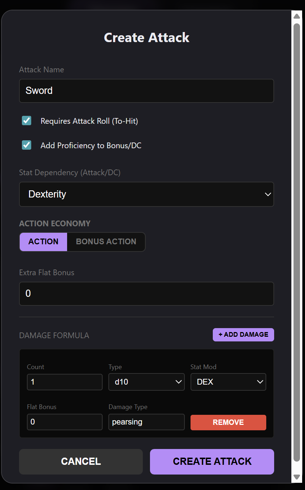

### Крок 3: Створення кампанії (Для Game Master)
Якщо ви Майстер гри (DM), перейдіть у розділ **Campaigns** та створіть нову кампанію. Система згенерує унікальний **Invite-код**, який потрібно надіслати вашим гравцям.

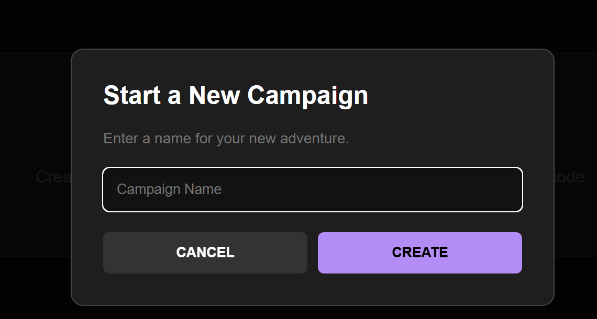

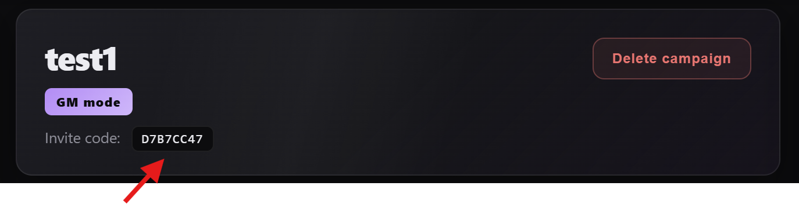

**Важливо:** Скопіюйте **Invite-код** (наприклад, `D7B7CC47`) та поділіться ним з гравцями. Кожен гравець зможе приєднатися до кампанії, вводячи цей код.

---

### Крок 4: Приєднання до групи
Гравці у своєму профілі натискають на кнопку "Приєднатися до кампанії", вводять отриманий Invite-код та обирають персонажа, яким хочуть грати у цій кампанії. Тепер Майстер бачить усіх учасників в одному місці.

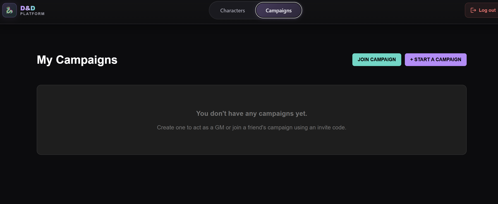

### Крок 5: Підготовка до бою (Encounter Setup)
Майстер створює нове бойове зіткнення (Encounter) всередині кампанії. 
- Додає монстрів з бази даних.
- Додає персонажів гравців.
- Натискає кнопку масової генерації ініціативи для монстрів (результати автоматично відправляються у Discord Webhook, якщо він налаштований).

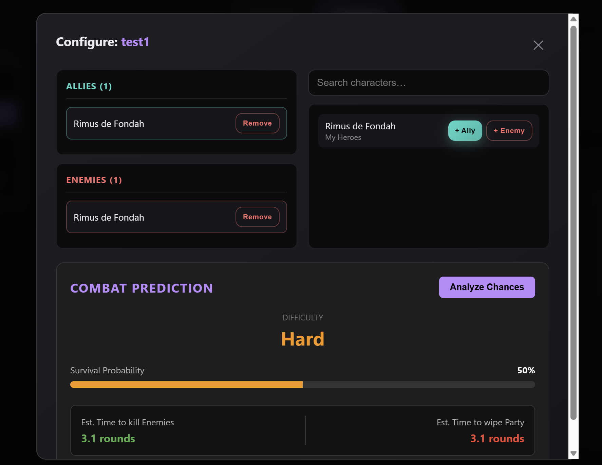

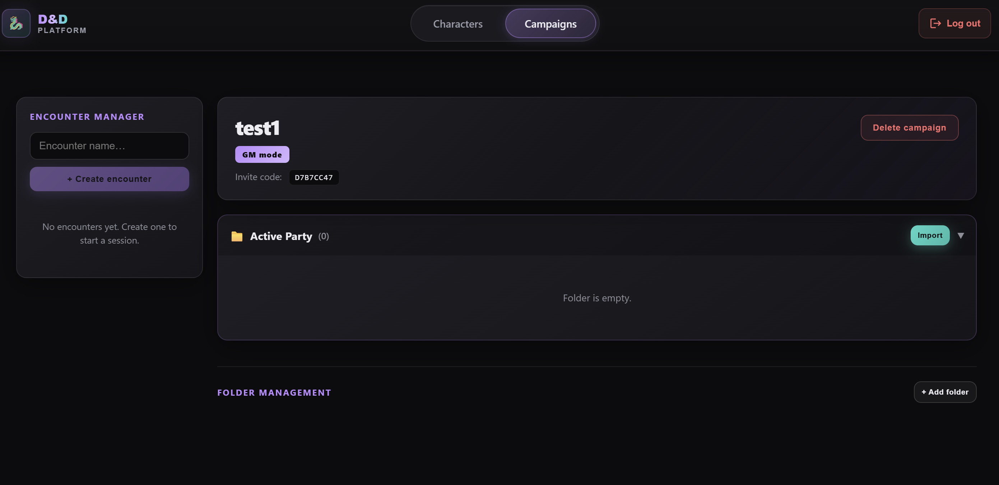

**Функції налаштування:**
- Додавання союзників (Allies) з персонажів гравців
- Додавання ворогів (Enemies) з монстрів
- Автоматичний розрахунок **Combat Prediction** (складність та ймовірність виживання)

### Крок 6: Ведення бою (Combat Tracker)
Запускається активна фаза бою. 
- **Майстер** керує чергою ходів за допомогою Drag-and-Drop, наносить шкоду монстрам і бачить точні цифри їхнього здоров'я.
- **Гравці** у реальному часі бачать зміну черги ходів. Завдяки системі Field of View (Захист від метагеймінгу), гравці не бачать точне HP ворогів — замість цього виводяться статуси на кшталт *"Healthy"*, *"Bloodied"*, *"Critical"*, *"Dead"*.

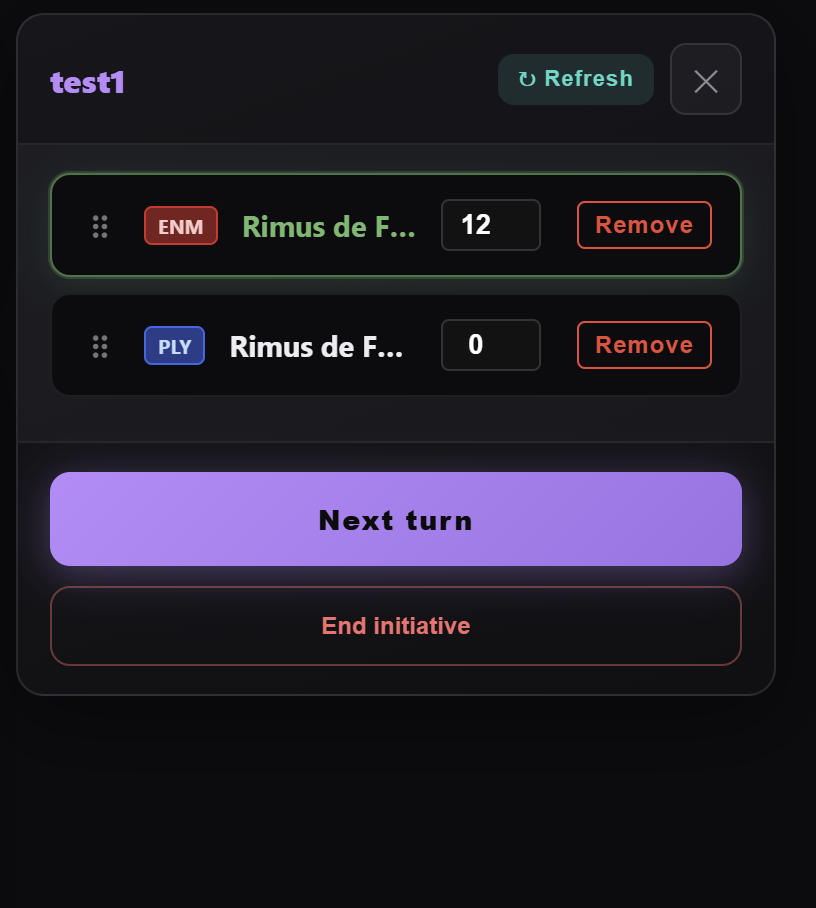

**Функції трекера:**
- Drag-and-Drop для змінення порядку ходів
- Кнопки "Next turn" та "End initiative" для керування фазою
- Швидкий доступ до розраховування ініціативи для кожного учасника
- Відправка результатів у Discord Webhook (якщо налаштовано)

### Крок 7: Аналітика складності бою (Combat Analytics)
У будь-який момент бою Майстер може відкрити вкладку аналітики. Сервер на основі характеристик учасників розрахує поточний **eDPR** (очікувану шкоду за раунд), **TTK** (час до знищення фракції) та видасть прогноз ймовірності виживання групи гравців.


**Метрики аналітики:**
- **Difficulty:** Рівень складності бою (Easy, Medium, Hard, Deadly)
- **Survival Probability:** Ймовірність виживання групи гравців (у відсотках)
- **Est. Time to kill Enemies:** Прогнозований час знищення ворогів (у раундах)
- **Est. Time to wipe Party:** Прогнозований час знищення групи гравців (у раундах)

---

## 🧪 Проблеми і рішення

| Проблема              | Рішення                            |
|----------------------|------------------------------------|
| **Overfetching (величезні JSON при Polling)** | Замінено `.Include()` на суворі LINQ `.Select()` проєкції + `.AsNoTracking()`. Розмір Payload впав з 1.5 МБ до 15 КБ. |
| **HTTP 429 Too Many Requests (Discord API)** | Розроблено асинхронний Batching-модуль, який акумулює повідомлення через `StringBuilder` і відправляє єдиним POST-запитом. |
| **Метагеймінг зі сторони гравців** | Імплементовано алгоритм Field of View (FOV) на рівні бекенду: HP ворогів замінюється на семантичні теги до серіалізації в JSON. |

---

## 🧾 Використані джерела / література

- Офіційна документація .NET 9 та ASP.NET Core
- React (Vite) Docs
- Discord Webhooks API
- Evans E. Domain-Driven Design: Tackling Complexity in the Heart of Software.